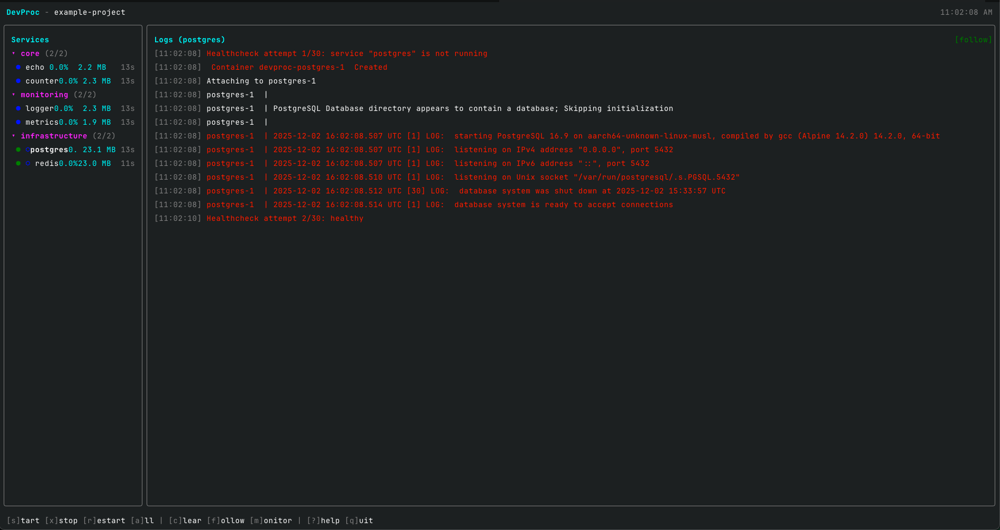

import { Card, CardGrid } from "@astrojs/starlight/components"
import { Image } from "astro:assets"
import bobby from "../../assets/bobby.png"

## Features

<CardGrid>
  <Card title="Unified Process Management" icon="rocket">
    Start, stop, and restart multiple services from a single TUI. No more juggling terminal windows.
  </Card>
  <Card title="Dependency Ordering" icon="list-format">
    Services start in the correct order based on dependencies. Wait for health checks before starting dependents.
  </Card>
  <Card title="Live Log Streaming" icon="document">
    View logs from all services or focus on one. Search with regex, export to files, and scroll through history.
  </Card>
  <Card title="Resource Monitoring" icon="seti:graphql">
    Real-time CPU and memory usage per service with sparkline graphs.
  </Card>
  <Card title="Docker Compose Integration" icon="seti:docker">
    Manage Docker Compose services alongside native services with unified control.
  </Card>
  <Card title="Keyboard-Driven" icon="laptop">
    Fast navigation with vim-style keybindings. Everything accessible without leaving the keyboard.
  </Card>
</CardGrid>

---

  <Image src={bobby} alt="Bobby - DevProc Mascot" />
  

    <em>Meet Bobby, the DevProc mascot. He keeps your processes running smoothly.</em>
  

